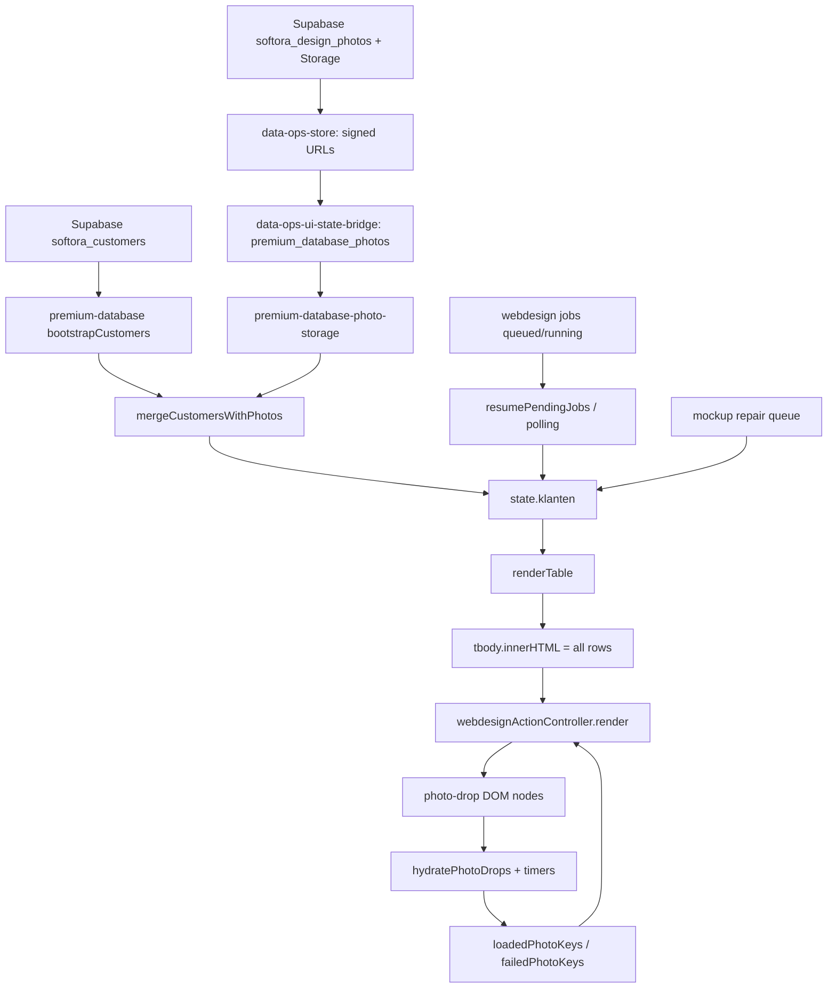

# Premium Database media-stabiliteit: onderzoekskaart

Datum: 2026-05-28
Status: onderzoek + fixfase gestart op dezelfde branch
Repo-basis na laatste sync: `25c7056e3577d3944325ce4b68c9dd009cda45da`
Live productie tijdens de eerste media-metingen: `cc652782d2fad10922973dddc205dadf14c9a07e`
Live productie na afrondende wait-check: `25c7056e3577d3944325ce4b68c9dd009cda45da`
Scope: `/premium-database`, vooral foto-vakken, mockups, herladen, fallback `!`, loaders en UI-stabiliteit.

Let op: tijdens afronding schoof `origin/main` door naar PR #558. Een directe live-check zag productie kort nog op `cc652782...`, daarna trok de wait-check groen naar `25c7056...`. PR #558 raakt coldmail image-frame code, niet de onderzochte premium-database media-controller.

Fix-update: na dit onderzoek is op dezelfde branch de eerste structurele fix aangebracht:

- Foto-loads krijgen een actieve binding/generatie-id, zodat oude timers van vervangen DOM-nodes geen nieuwe foto-status meer kunnen overschrijven.
- De fallback-timer is verruimd van 6s naar 20s, zodat zware maar geldige afbeeldingen minder snel vals op `!` vallen.
- Tabelafbeeldingen gebruiken nu lazy/low-priority loading met vaste 34x34 image-attributen.
- Nieuwe Supabase Storage uploads krijgen expliciete cache headers.
- Signed URLs worden per storage-pad hergebruikt zolang ze nog fris zijn.
- Regressietests bewijzen dat een oude detached fallback-timer geen actuele loaded foto meer kan omzetten naar fallback.

## Conclusie in gewone taal

Dit lijkt geen enkel los bugje te zijn. De pagina heeft een ketting van factoren die elkaar versterken:

1. De pagina vervangt vaak de hele tabel-HTML.
2. De foto-URL's zijn Supabase signed URLs en veranderen bij elke photo-state read.
3. De frontend gooit de querystring van signed URLs weg bij de interne laad-sleutel.
4. Oude laad-timers blijven leven nadat hun oude DOM-node al vervangen is.
5. Als zo'n oude timer later afgaat, kan hij dezelfde queryloze sleutel als "failed" markeren.
6. De volgende render toont dan bewust het `!`-icoon, ook als de actuele afbeelding op dat moment prima kan laden.
7. De standaardtab laadt grofweg 134 afbeeldingen met samen ongeveer 131 MB aan HEAD-content-length, allemaal met `cache-control: no-cache`, en de afbeeldingen worden eager/high-priority gevraagd. Daardoor is het tijdvenster voor race-conditions groot.

De beste huidige hypothese is dus: **de zichtbare instabiliteit komt uit de combinatie van signed URL churn, volledige tabel-rerenders, queryloze laad-cache, oude timers en veel te zware eager image-loads.** Refresh lost het vaak op omdat de pagina-controller opnieuw start en de lokale `failedPhotoKeys` leeg zijn.

Wat ik niet claim: ik claim nog niet dat dit de enige oorzaak is. De ontbrekende bewijslaag is een ingelogde live browser-waterfall met console events, omdat de pagina zonder login naar `/premium-personeel-login` redirect.

## Systeemkaart



## Bewezen ketting achter het `!`

Het `!` is geen browser-foutmelding. Het is eigen UI:

- `assets/premium-database-webdesign-action.js:15` definieert `FALLBACK_ICON` als een span met `!`.
- `assets/premium-database-webdesign-action.js:165-179` zet bij falen `data-photo-error="true"` en injecteert het fallback-icoon.
- `assets/premium-database-webdesign-action.js:8` zet de fallback-timer op 6000 ms.
- `assets/premium-database-webdesign-action.js:211-216` markeert een afbeelding als failed als `image.complete`/`naturalWidth` na die timer niet goed staat.
- `assets/premium-database-webdesign-action.js:133-138` verwijdert bij failed dezelfde key uit `loadedPhotoKeys` en zet hem in `failedPhotoKeys`.

Dat verklaart waarom refresh het vaak oplost: `failedPhotoKeys` leeft in de controller van de huidige pagina-load. Een refresh bouwt die controller opnieuw op.

### Extra harde reproductie: oude timer vergiftigt nieuwe render

Met de huidige controller is lokaal gereproduceerd:

```json
{
  "timersScheduled": 2,
  "sameKeyForDifferentSignedQuery": true,
  "currentDropLoadedBeforeOldTimer": true,
  "beforeOldDetachedTimerShowsFallback": false,
  "afterOldDetachedTimerShowsFallback": true,
  "afterOldDetachedTimerMarkedError": true
}
```

Betekenis: een oude, inmiddels losgeraakte foto-node kan later alsnog dezelfde queryloze foto-key als failed markeren. De actuele node was daarvoor al succesvol geladen. Daarna rendert dezelfde klant toch als fallback `!`.

Dit is de sterkste concrete verklaring voor: "foto was al ingeladen, daarna verschijnt opeens `!`, refresh lost het op."

## Signed URL churn

De storage-read maakt bij elke call nieuwe signed URLs:

- `server/services/data-ops-store.js:611-675` leest maximaal 500 designfoto's en maakt per foto/mockup opnieuw een signed URL.
- `server/services/data-ops-ui-state-bridge.js:315-321` gebruikt die signed URLs voor `premium_database_photos`.
- `assets/premium-database-photo-storage.js:91-126` zet `websitePhotoUrl` en `websiteMockupUrl` terug in de frontend als `websitePhoto` en `websiteMockup`.

Live read-only meting op 2026-05-28 21:11 CEST:

```json
{
  "firstCount": 274,
  "secondCount": 274,
  "comparedPhotos": 274,
  "samePhotoUrl": 0,
  "samePhotoPath": 274,
  "samePhotoPathDifferentQuery": 274,
  "comparedMockups": 270,
  "sameMockupUrl": 0,
  "sameMockupPath": 270,
  "sameMockupPathDifferentQuery": 270
}
```

Elke gemeten foto/mockup kreeg dus een nieuwe volledige URL, maar hetzelfde origin+path. Precies dat botst met de frontend-laadkey.

## Queryloze laad-sleutels

De controller gebruikt voor HTTP(S)-bronnen alleen `origin + pathname` als fingerprint:

- `assets/premium-database-webdesign-action.js:100-114` stript querystrings.
- `assets/premium-database-webdesign-action.js:116-118` bouwt de load key uit kind, customer id en die queryloze fingerprint.
- `assets/premium-database-webdesign-action.js:598` en `:615` beschouwen foto/mockup als loaded als die key in `loadedPhotoKeys` staat.
- `assets/premium-database-webdesign-action.js:189` stopt binding als `data-photo-loaded="true"` al op de node staat.

Reproductie met twee verschillende signed URLs:

```json
{
  "keyA": "photo-cust-1-https://storage.example.com/render.png",
  "keyB": "photo-cust-1-https://storage.example.com/render.png",
  "sameKey": true
}
```

Dit is logisch bedoeld om signed URL query-wissels niet alles opnieuw te laten flikkeren, maar in combinatie met oude timers wordt dezelfde keuze gevaarlijk.

## Volledige tabel-rerenders

De pagina rendert niet incrementeel per rij. De volledige tbody wordt vervangen:

- `premium-database.html:2338` doet `nodes.tbody.innerHTML = filtered.map(...).join("")`.
- `premium-database.html:2366` laat `renderPage()` direct `renderTable()` doen.

Belangrijke render-triggers:

- Eerste render: `premium-database.html:3050`.
- Boot-flow met fotoherstel, 16-image preload, render en job-resume: `premium-database.html:3199-3204`.
- Customer bootstrap met forced photo-map load: `premium-database.html:3000-3031`.
- Silent refresh via interval, focus en visibility: `premium-database.html:3044`.
- Zoek/filter/sort acties: `premium-database.html:3081-3088`.
- Pending job zet direct render: `assets/premium-database-webdesign-action.js:398-402`.
- Lopende jobs worden geladen en gepolld: `assets/premium-database-webdesign-action.js:501-533`.
- Auto-mockup repair rendert na afronding: `assets/premium-database-webdesign-action.js:278-299`.

Gevolg: foto-nodes kunnen vervangen worden terwijl hun `load`, `decode` of fallback timer nog loopt.

## Zware image-load druk

Live read-only meting op 2026-05-28 21:12 CEST, benadering van de standaardtab:

```json
{
  "customers": 1000,
  "baseBenaderbaar": 819,
  "mailReadyRows": 67,
  "imageRequests": 134,
  "headOk": 134,
  "totalHeadMB": 131.4,
  "largestMB": [2.19, 2.11, 2.09, 2.06, 2.04, 2.04, 2.03, 2.02],
  "cacheControls": { "no-cache": 134 },
  "types": { "image/png": 67, "image/jpeg": 67 }
}
```

Waarom dit zwaar is:

- Foto's worden gegenereerd op `1024x1536`: `server/services/premium-database-webdesign-jobs.js:398`.
- De foto wordt in een vakje van ongeveer 34x34 px getoond: `assets/premium-database-webdesign-action.js:30`.
- De rendered image-tag gebruikt `loading="eager" fetchpriority="high"` voor foto en mockup: `assets/premium-database-webdesign-action.js:604-622`.
- De boot-preload doet slechts 16 bronnen met 1200 ms timeout: `assets/premium-database-webdesign-action.js:569-587` en `premium-database.html:3202`.
- De live storage headers voor de gemeten zichtbare afbeeldingen waren `cache-control: no-cache`.

Dit betekent niet dat alle 131 MB altijd opnieuw volledig gedownload wordt, maar wel dat de browser continu opnieuw moet valideren en dat veel grote image-decodes tegelijk kunnen spelen. Dat vergroot precies het 6-seconden-racevenster.

## Storage-vorm en omvang

Live read-only meting op 2026-05-28 21:11 CEST:

```json
{
  "activeRows": 274,
  "photoMB": 711.4,
  "mockupMB": 42.1,
  "totalMB": 753.6,
  "byMime": {
    "image/png": 265,
    "image/jpeg": 9
  }
}
```

De serverupload gebruikt geen expliciete `cacheControl`:

- `server/services/data-ops-store.js:450-453` uploadt de hoofdafbeelding met `contentType` en `upsert`.
- `server/services/data-ops-store.js:464-467` uploadt de mockup idem.
- `server/services/premium-database-webdesign-jobs.js:713-758` schrijft gegenereerde AI-foto's via structured storage.

De frontend manual upload comprimeert wel, maar server-gegenereerde AI-foto's blijven in praktijk grotendeels PNG. Dat verklaart de grote opslag- en load-druk.

## State-diff maskeert URL-wissels

Een extra subtiele factor:

- `premium-database.html:2083` serialiseert elke geldige URL als alleen `"url"`.
- `premium-database.html:2100` zet `state.klanten = nextCustomers` ook als `changed=false`, maar rendert dan niet.

Dus nieuwe signed URL's kunnen stil in `state.klanten` terechtkomen zonder render. Een latere ongerelateerde render kan dan ineens DOM vervangen met nieuwe `src`-waarden, terwijl de load-cache op queryloze keys oude aannames vasthoudt.

## Job-laag

Live read-only meting op 2026-05-28 21:13 CEST:

```json
{
  "total": 464,
  "byStatus": {
    "error": 209,
    "done": 253,
    "running": 1,
    "queued": 1
  },
  "active": [
    {
      "status": "running",
      "owner": "se***dffdf9bc",
      "customerId": "import-240-db-mohsau64-zcn7ta",
      "company": "Adequat Kastanjehout",
      "ageMinutes": 34458,
      "hasError": false
    },
    {
      "status": "queued",
      "owner": "co***::system",
      "customerId": "manual-import-maxantis-com-0154",
      "company": "Maxantis Benelux B.V.",
      "ageMinutes": 209,
      "hasError": false
    }
  ]
}
```

Relevante code:

- `server/services/premium-database-webdesign-jobs.js:695-710` toont queued/running jobs per owner.
- `server/services/premium-database-webdesign-jobs.js:927-950` kan stale running jobs terug naar queued zetten en inline verwerken.
- `server/services/premium-database-webdesign-jobs.js:1068-1109` verwerkt status-requests.
- `server/services/premium-database-webdesign-jobs.js:1112-1126` levert zichtbare jobs aan de frontend.
- `assets/premium-database-webdesign-action.js:501-533` hervat running jobs op de pagina en start polling.

Deze jobs zijn waarschijnlijk niet de hoofdoorzaak van het `!`, maar ze zijn wel render- en refresh-bronnen. De running job van ongeveer 24 dagen oud is bovendien systeemruis die apart opgeschoond/verklaard moet worden.

## Mockup v6/v7 conflict

De server is inmiddels v7, maar er staan veel oudere renderer-signalen in storage:

- Frontend mockupmodule gebruikt `DEVICE_MOCKUP_VERSION = "v6"`: `assets/premium-database-webdesign-mockup.js:4`.
- Serverdiagnose markeert suspect server-v6: `server/services/premium-database-webdesign-jobs.js:320-350`.
- Frontend asset-state keurt mockupkwaliteit goed op status/orientation/check signalen, niet op suspect renderer: `assets/premium-database-webdesign-asset-state.js:21-30`.

Live diagnose op 2026-05-28 21:13 CEST:

```json
{
  "currentServerRenderer": "softora-server-device-v7",
  "checked": 274,
  "ok": 197,
  "needsReview": 77,
  "byRenderer": {
    "softora-server-device-v7": 25,
    "softora-server-device-v6": 73,
    "softora-browser-device-v6": 1,
    "unknown": 4,
    "softora-native-device-v6": 171
  },
  "byReason": {
    "suspect_server_renderer_v6": 73,
    "checked_before_visual_renderer_gate": 73,
    "missing_mockup": 4
  }
}
```

Dit verklaart vooral inconsistente "mailklaar"/diagnose-interpretatie en mogelijke mockup-repair-renders. Het verklaart niet op zichzelf waarom een geladen foto later `!` wordt, maar het vergroot de achtergrondactiviteit rond dezelfde kolom.

## Wat waarschijnlijk niet de primaire oorzaak is

- Productieversie-mismatch als verklaring voor deze media-race: bij de eerste media-check draaide live exact op dezelfde onderzochte media-code. Tijdens afronding liep live kort achter op de net gemergde `origin/main`, maar de wait-check trok groen naar `25c7056...`. Dat is geen verklaring voor de hier bewezen oude-timer/signed-URL race.
- Een zuiver CSS-layout-probleem: de foto-cellen hebben vaste afmetingen (`premium-database.html:543-580` en injected CSS in `assets/premium-database-webdesign-action.js:30`). Layout kan nog bewegen door DOM-vervanging/loaders, maar de basismaat ontbreekt niet.
- Een random browser-icoon: het `!` komt uit eigen frontendcode.
- Alleen Vercel asset-cache: de live asset is bereikbaar met Vercel HIT, maar productiecommit klopt en de HTML/API zijn private/no-store.
- Alleen tests: de huidige tests zetten veel huidig gedrag juist vast, waaronder fallback na 6 seconden, `loading="eager" fetchpriority="high"` en de 16-image preload (`test/contracts/premium-database-ui.test.js:538-705`).

## Grootste bewijs-gat

De live pagina en photo-state API zijn afgeschermd:

- `https://www.softora.nl/premium-database` geeft zonder sessie `302` naar `/premium-personeel-login?next=%2Fpremium-database`.
- `https://www.softora.nl/api/ui-state-get?scope=premium_database_photos` geeft zonder sessie `401`.

Daarom ontbreekt nog een ingelogde browser-waterfall met:

- Network: exacte image request timing, cache hits/misses, aborted requests, decode timing.
- Console met `?debugMedia=1`: events `image-load-start`, `image-load-success`, `image-load-error`, `render-table`, `photo-map-load-*`.
- Performance marks rond renders, visibility/focus refresh en job polling.
- DOM snapshots voor en na het moment dat `!` verschijnt.

Zonder die laag is het niet eerlijk om "100% alles bewezen" te zeggen. Met de code- en data-bewijzen is de race-chain wel sterk genoeg om het fixplan op te baseren.

## Fixplan, nog niet uitvoeren

Fase 0 - meten zonder gedrag te wijzigen:

- Voeg tijdelijk veilige media-observability toe achter `debugMedia=1`.
- Log per image key: node-id/generation-id, src-path, signed-query-hash, start, load, decode, fallback, detached/connected status.
- Leg vast of fallback gebeurt op een node die niet meer `isConnected` is.

Fase 1 - stop de `!` race:

- Maak timers generatie- of node-gebonden en laat oude timers niets meer doen als hun drop niet meer connected is of als de key inmiddels door een nieuwere generatie geladen is.
- Laat `markPhotoKeyFailed` niet blind een reeds geladen key wissen als de failing node ouder is dan de laatste succesvolle load.
- Bind image lifecycle opnieuw wanneer de daadwerkelijke `img.src/currentSrc` wijzigt, ook als de queryloze key al loaded is.
- Overweeg load-cache te baseren op storage path plus content hash/version, niet alleen origin+pathname.

Fase 2 - verminder laaddruk:

- Maak thumbnails voor tabelweergave in plaats van 1024x1536 originelen.
- Verlaag eager/high-priority naar lazy of intersection-based loading voor offscreen rows.
- Zet expliciete storage cache headers waar veilig, of serveer stabiele thumbnail URLs via een server/proxy/cache-laag.
- Beperk boot-preload tot echt zichtbare bronnen en meet of 16/1200 ms nog logisch is.

Fase 3 - render-stabiliteit:

- Stop met volledige `tbody.innerHTML` voor elke kleine statewijziging.
- Werk rijen keyed/incrementeel bij, of ten minste foto-cellen alleen wanneer hun bron of status echt verandert.
- Scheid job/mockup render-events van volledige tabel-refreshes.

Fase 4 - data-ops en jobs opschonen:

- Verklaar of verwijder stale queued/running jobs veilig.
- Maak job-polling minder render-intensief.
- Breng mockup v6/v7 regels in backenddiagnose en frontend mailklaar-state op een lijn.

Fase 5 - acceptatiecriteria:

- Na vijf harde refreshes en vijf focus/visibility-cycli verschijnt geen `!` op foto/mockups waarvan HEAD 200 is.
- Geen fallback-event op detached DOM nodes.
- Geen reload-storm bij silent refresh: nieuwe signed query mag niet leiden tot nieuwe DOM/image lifecycle als storage path en content hash gelijk zijn.
- Standaardtab vraagt geen 130+ MB aan tabelafbeeldingen meer voor thumbnails.
- Tests bewijzen expliciet: oude timer kan nieuwe load niet meer overschrijven.
